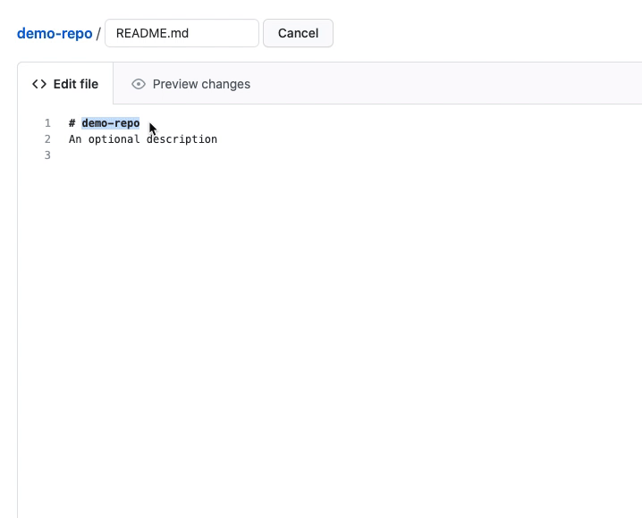

* Viewing your Website Files on GitHub.com
* Editing your Website Files on GitHub.com
* Creating a New Page on GitHub.com
* Logging into your GitHub Account from your Website
* Editing a Single Page Quickly from your Website

# Viewing your Website Files on GitHub.com

The files for your website can be found in your account on github.com. To see your website files, log into your account at [GitHub.com](https://github.com). Then choose the repo you are currently working on. The address that shows the files in your repo will look like:
> http://github.com/your-user-name/your-repo-name

For now, you should just have a single file: README.md. The contents of the file will be displayed on the main page for your site at:
> http://visual-essays.app/your-user-name/your-repo-name

# Editing your Website Files on GitHub.com

If you edit the content of a file in your GitHub repository, it will be reflected (almost instantly) on your website. We can see this by changing our README.md file. To make changes, click on the pencil icon. (Alternatively, click on the "README.md" link first and then the pencil icon to edit.)

Once inside the editor, you can write using plain-text, including Markdown. The editor has two panes, "Edit file" and "Preview Changes." Previewing changes is a handy way to make sure that your Markdown will render in the way you intended.

When you preview changes, any text you have a **deleted** will also be shown but noted with a **red indicator**. The text you are adding will indicated in **green**.

When you finish making changes, scroll to the bottom of the screen to "Commit Changes." If you have made significant changes, it is helpful to place a short description of the changes made. Finally, click the green button "Commit Changes" to save your work.

Each time you "Commit Changes," GitHub will save a version of your website. If you make a major mistake (deleting a file, overwriting important text, etc.), any of the previous versions of your website can be recovered. The recovery process is beyond this tutorial, but the important thing to know is that your site is being saved each and every time you commit changes.

# Creating a New Page on GitHub.com

# Logging into your GitHub Account from your Website

# Editing a Single Page Quickly from your Website
