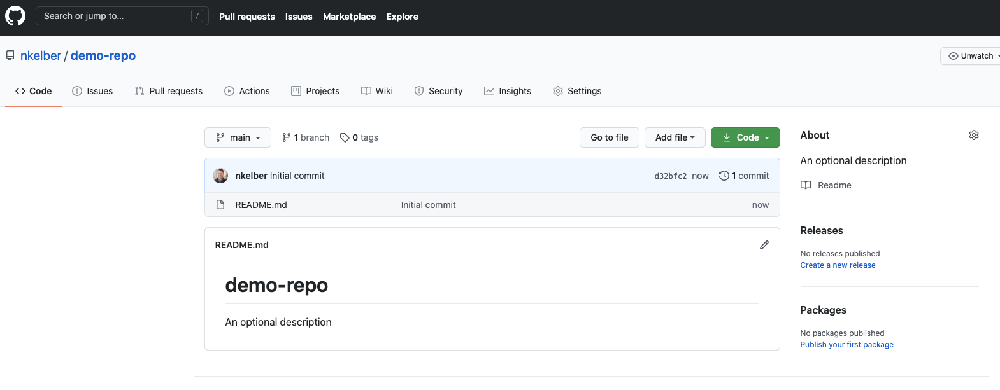
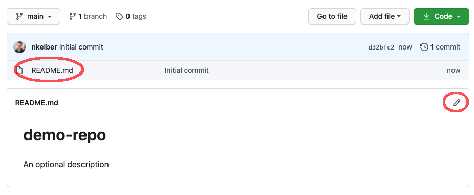
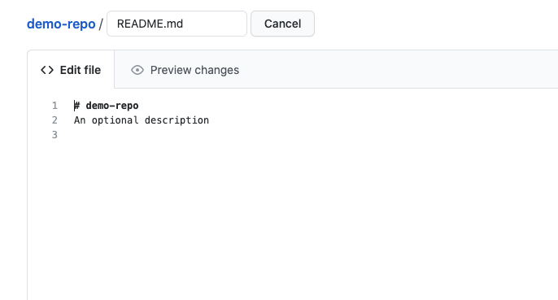

[<- Home](https://docs.visual-essays.app/)  
Viewing your Website Files on GitHub.com  
Editing your Website Files on GitHub.com  
Creating a New Page on GitHub.com  
Logging into your GitHub Account from your Website  
Quickly Editing a Single Page from your Website  
[The Parts of a Visual Essay ->](https://docs.visual-essays.app/parts-of-essay)
____

# Creating and Editing Pages

Any changes to your site will be changes to the site repository files at GitHub.com. We can create a new page, edit pages, and upload files directly on GitHub.com. The Visual Essay Tool also includes a component to make quick changes directly from your site. This quick editor can change the code on an existing page, but it cannot create a new page or add files to your site. 

# Viewing your Website Files on GitHub.com

The files for your website can be found in your account on github.com. To see your website files, log into your account at [GitHub.com](https://github.com). Then choose the repo you are currently working on. The address that shows the files in your repo will look like:
> http://github.com/your-user-name/your-repo-name

For now, you should just have a single file: README.md. The contents of the file will be displayed on the main page for your site at:
> http://visual-essays.app/your-user-name/your-repo-name

# Editing your Website Files on GitHub.com

If you edit the content of a file in your GitHub repository, it will be reflected (almost instantly) on your website. We can see this by changing our README.md file. To make changes, click on the pencil icon. (Alternatively, click on the "README.md" link first and then the pencil icon to edit.)

Once inside the editor, you can write using plain-text, including Markdown. The editor has two panes, "Edit file" and "Preview Changes." Previewing changes is a handy way to make sure that your Markdown will render in the way you intended.

When you preview changes, any text you have a **deleted** will also be shown but noted with a **red indicator**. The text you are adding will be indicated in **green**.

When you finish making changes, scroll to the bottom of the screen to "Commit Changes." If you have made significant changes, it is helpful to place a short description of the changes made. Finally, click the green button "Commit Changes" to save your work.

Each time you "Commit Changes," GitHub will save a version of your website. If you make a major mistake (deleting a file, overwriting important text, etc.), any of the previous versions of your website can be recovered. The recovery process is beyond this tutorial, but the important thing to know is that your site is being saved each and every time you commit changes.

After committing changes, they will appear (almost instantly) on your site.

# Creating a New Page on GitHub.com

Now that you have created changes on the main page of your site, you may be ready to create another page. The content for your main page is inside the `README.md` file in the root (or main/bottom) directory of your repository. To create another page for your site, we will create a new `README.md` file inside a new directory/folder.

To create a new directory and `README.md`, start at the root directory of your repository. Click on "Add file" then choose "Create new file." Supply a folder name followed by a forward slash (/) then add the file name `README.md`. Finally, add any content you wish to the new page. When you commit changes, the folder and the `README.md` file will be created.

If you would like to link your main page to this new page, create a hyperlink using Markdown. The link would look something like:

`Check out this [research essay](new-page)` 
where `new-page` is the name of the directory/folder. (There is no need to include `README.md` at the end of your link address.)

# Logging into your GitHub Account from your Website

Once a page has been created, we have created a simple interface for editing built directly into your website. Navigate to your website at:

>https://visual-essays.app/your-user-name/your-repo-name

Click on the "hamburger menu" (the set of three horizontal lines) in the upper, lefthand corner and choose "Login." 

Supply your login information for your github account. This information will be saved, making it easy to edit any page on your site quickly.

# Quickly Editing a Single Page from your Website

1. Complete the previous step "Logging into your GitHub Account from your Website." 
2. Navigate to the particular web page you would like to edit.
3. Click the hamburger icon 
4. Choose "Edit Page"
5. An editor window will appear allowing you to quickly make any changes.
6. Remember to commit changes!
___
[<- Home](https://docs.visual-essays.app/) | [The Parts of a Visual Essay ->](https://docs.visual-essays.app/parts-of-essay)
