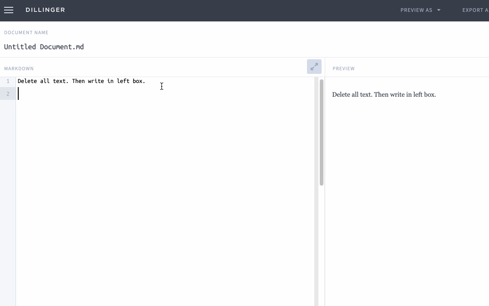
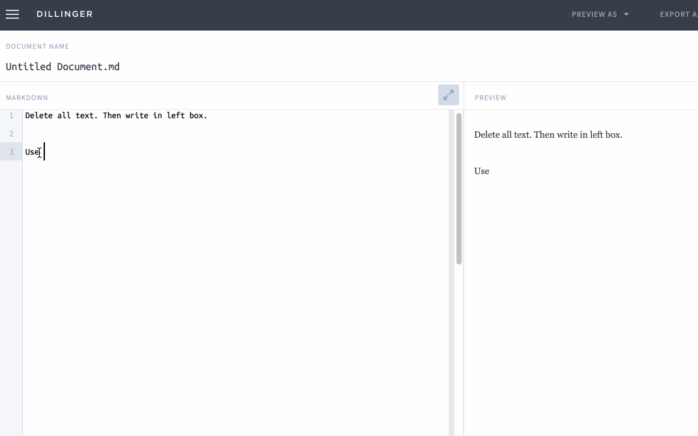
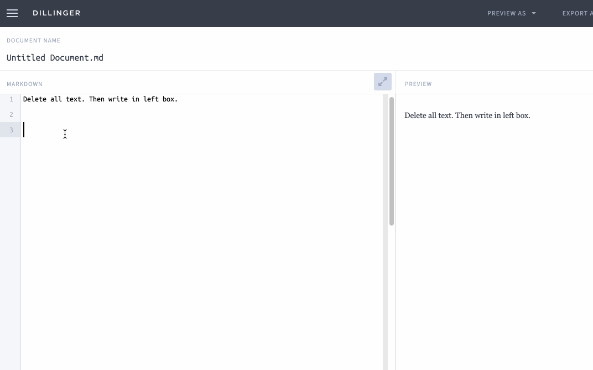
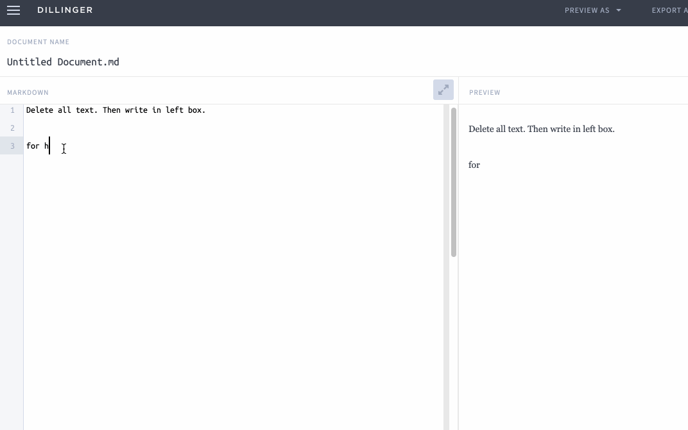
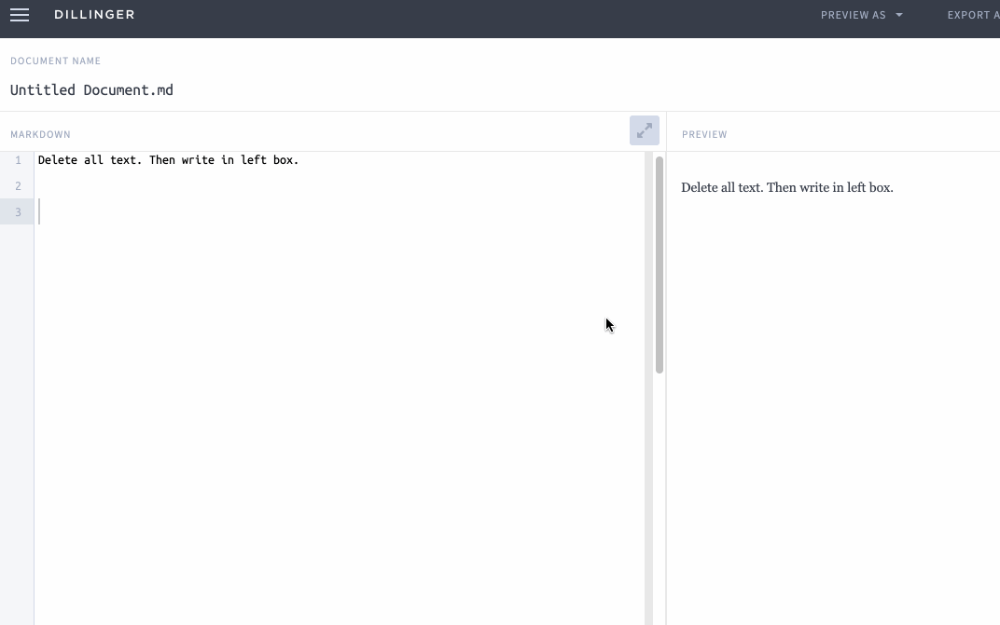

[Home](../) | [<- Previous How to Write a Visual Essay](authoring-intro.md) | Learn Markdown in 30 Minutes | 
___

# Learn Markdown in 30 Minutes

Markdown is a simple way to format text. It allows you to mark text, so that it has basic formatting. In this short tutorial, we'll show you how to use markdown to do the following:

* Create Headers/Titles
* Add emphasis with italic and bold
* Create lists (bulleted and numbered)
* Create hyperlinks
* Insert images
* Insert a horizontal rule/divider

# Viewing Your Writing in a Markdown Editor

In this quick lesson, we'll use a free online Markdown Editor called [Dillinger](http://dillinger.io). (You could also use another editor such as [StackEdit](http://stackedit.io) or [Editor.md](https://pandao.github.io/editor.md/en.html). Whatever editor you choose, the editor will display the original text that you edit on the left and preview the transformed text (as it would appear in a web browser) on the right side. Select all the text in the Markdown box on the left and delete it so we can start with a fresh slate. Try creating each of these in your editor!

# Create Headers/Titles

A header is text that starts a new section, like a title. To create a large header, simply insert a hashtag (#) in front of the title. You can use additional hashtags for smaller headers. These are useful for creating sub-sections of a larger document. 

# Add emphasis with italic and bold

Italicize words by adding a single asterisk or underscore on each side.
Bold words by adding two asterisks or two underscores on each side.

# Create lists (bulleted and numbered)

Create a bulleted using asterisks or a numbered list using numbers followed by periods.

# Create hyperlinks

Create hyperlinks by putting the link text in brackets and the link address in parentheses. 

# Insert images

Insert images by starting with an exclamation point, followed by an image description for accessibility in brackets, and finally put the address where the image is stored on a server into a set of parentheses.

# Insert a horizontal rule/divider

Insert a horizontal rule by writing three underscores, asterisks, or hyphens in a row.

# Insert footnote

Add a footnote by putting a caret followed by a number in a set of brackets. The number will turn into a hyperlink that brings readers to the appropriate footnote at the bottom of the page.

At the bottom of the page, write the same footnote construction (a caret followed by a number in brackets) then a colon. Any text written after that will appear in the footnote at the bottom of the page. In this example, our footnote is a hyperlink to an article in *The Wall Street Journal*.
This assertion requires a footnote. [^1]

# Print your own Markdown Cheat Sheet
If you find yourself forgetting how to do something in markdown, there are many markdown cheatsheets available on the web. Here is [one you can print out](https://guides.github.com/pdfs/markdown-cheatsheet-online.pdf) and keep handy.

___
