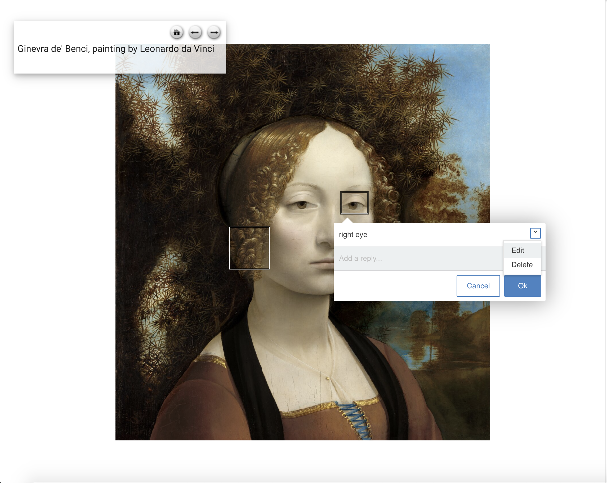
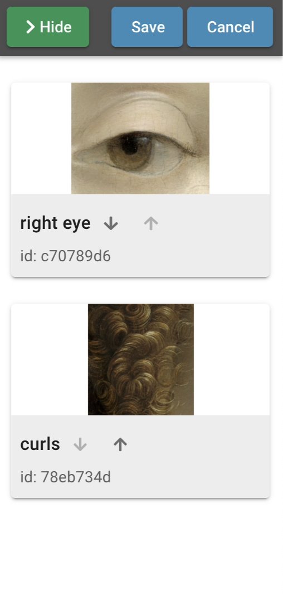

# Annotation Tool

## Overview
{: .right .dropshadow .border .thumb-300w} 
The annotation tool is used to add, delete, edit and reorder annotations for IIIF images used in the visual essay. This tool uses [Annotorious](https://recogito.github.io/annotorious/), a JavaScript image annotation library, on top of [OpenSeadragon](https://openseadragon.github.io/), an open-source, web-based viewer for high-resolution images, to display and edit annotations for IIIF images.

## Accessing the tool
To access the annotation tool, the user must be logged into Github using the Login option found in the navigation panel in the top left corner.

Once logged in, the button to access the tool should show up upon hover over a IIIF image. Below is an image of the button highlighted in green.
{: .left .dropshadow .border .thumb-300w} 
Clicking the button will open up a separate window to edit annotations.

## Using the tool
To create and add a new annotation, hold down the `SHIFT` key while clicking and dragging the mouse.

To edit or remove existing annotations, click on the annotation in the image and click the down arrow on the right side of the dialog box to access the drop down menu to edit or delete.

{: .left .dropshadow .border .thumb-300w} 

To reorder the sequence of annotations, click the 'Show Annotations' button in the top right corner of the tool to open the side bar menu that lists all annotations and click the 'Reorder' button at the top. Use the 'up' or 'down' arrows for each annotation to reorder, then click the 'Save' button to save changes or 'Cancel' button to discard changes to exit.

{: .left .dropshadow .border .thumb-300w} 
